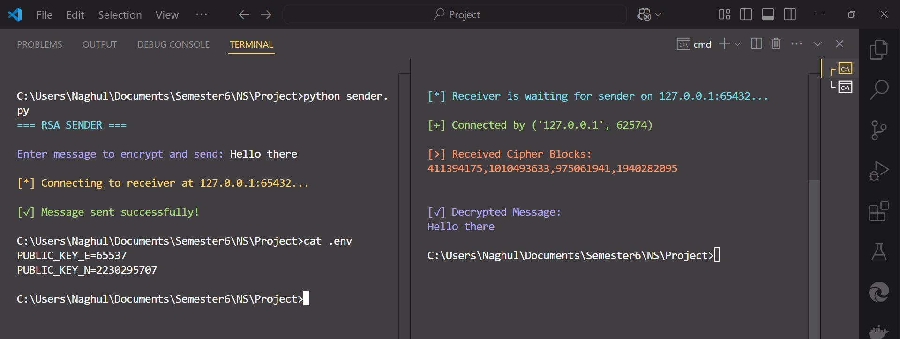

# Network Security Project
## Submitted By: Naghul Pranav A S (CS22B1037)

This project focuses on implementing encryption and decryption techniques to secure communication over a network, specifically using RSA (Rivest-Shamir-Adleman) public-key cryptography. It consists of two components: a receiver that generates an RSA key pair (public and private keys) and waits for incoming encrypted messages, and a sender that encrypts a message using the receiver's public key and transmits it over a socket-based network. The encrypted message is divided into blocks, and each block is decrypted by the receiver using its private key. The system ensures the confidentiality of the message during transmission, making it a practical demonstration of secure communication in network security.

---

# Receiver

**Imports and Config:**
```python
import socket                       # For TCP communication.
from dotenv import load_dotenv      # For loading environment variables.
from colorama import Fore, Style    # For colored terminal output.
import random                       # For random number generation.
import sympy                        # For checking if a number is prime.
```

**Constants:**
```python
HOST = '127.0.0.1'           # Localhost IP.
PORT = 65432                 # Port to listen on.
```

**Function: `generate_prime(bits=5)`**
- Generates a random 5-digit prime number using sympy.

**Function: `generate_rsa_keys()`**
- Prints status.
- Generates two distinct 5-digit primes `p` and `q`.
- Computes `n = p * q` and Euler's totient `phi`.
- Sets public exponent `e = 65537` (standard choice).
- Computes private exponent `d = e⁻¹ mod φ(n)`.
- Prints all RSA parameters.
- Saves `(e, n)` to `.env` for the sender to read.

**Function: `decrypt_block(d, n, block_int)`**
- Decrypts an integer block using `d` and `n`.
- Converts the decrypted integer to bytes.

**Function: `start_server()`**
- Loads `.env` variables (optional here).
- Generates RSA key pair.
- Starts a TCP server on `HOST:PORT`.
- Waits for connection from sender.
- Receives comma-separated encrypted integers.
- Decrypts each block and combines into a full message.
- Prints the final plaintext message.

**Function: `main()`**
- Prints title.
- Starts the receiver server.

**Block: `if __name__ == "__main__"`**
- Runs the program when executed directly.

---

# Sender

**Imports and Config:**
```python
import socket                       # For TCP communication.
import os                           # For reading environment variables.
from dotenv import load_dotenv      # Loads .env file containing public key.
from colorama import Fore, Style    # For colored terminal output.
```

**Constants:**
```python
HOST = '127.0.0.1'           # Receiver's IP address (localhost).
PORT = 65432                 # Receiver's listening port.
```

**Function: `split_into_blocks(data: bytes, block_size: int)`**
- Splits the byte-encoded message into chunks that fit RSA block size.

**Function: `encrypt_message(e, n, message: str)`**
- Encodes message into bytes.
- Calculates max block size based on RSA key size.
- Splits the message into byte blocks.
- Encrypts each block using RSA: `c = m^e mod n`.

**Function: `main()`**
- Loads public key `(e, n)` from `.env`.
- Prompts user to input a message.
- Encrypts the message into blocks.
- Joins the encrypted integers into a comma-separated string.
- Opens TCP socket to connect to receiver.
- Sends encrypted message to receiver.
- Prints success confirmation.

**Block: `if __name__ == "__main__"`**
- Executes `main()` when the script runs directly.

---

# Output

## Receiver
```
=== RSA RECEIVER ===
[*] Generating RSA Key Pair...
[+] Prime p: 59359
[+] Prime q: 37573
[+] Modulus n = p * q: 2230295707
[+] Public Key (e, n): (65537, 2230295707)
[+] Private Key (d, n): (456269057, 2230295707)

[*] Receiver is waiting for sender on 127.0.0.1:65432...
```

## Sender
```
=== RSA SENDER ===

Enter message to encrypt and send: Hello there

[*] Connecting to receiver at 127.0.0.1:65432...

[✓] Message sent successfully!
```

## Receiver
```
[+] Connected by ('127.0.0.1', 62574)

[>] Received Cipher Blocks:
411394175,1010493633,975061941,1940282095


[✓] Decrypted Message:
Hello there
```

## .env
```
PUBLIC_KEY_E=65537
PUBLIC_KEY_N=2230295707
```

